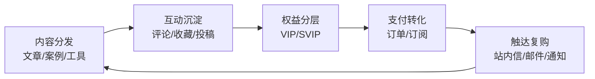

# OpenClaw 智信 · 内容变现与私域运营引擎（Laravel + Vue）

> **定位**：面向内容团队 / 社区产品 / 创业团队的一体化“内容 + 会员 + 运营后台”项目。  
> **目标**：把“内容站”升级成“可变现的增长系统”：内容分发 → 互动沉淀 → 会员分层 → 支付转化 → 触达复购。  
> **说明**：本目录即 Laravel 根目录（`artisan`、`docker/`、`docker-compose*.yml` 同级）。

## 🌟 为什么值得用（优势 / 亮点）

- **可运营闭环，不是 Demo**：内容承载、UGC 互动、审核风控、会员分层、订单支付、触达复购全链路打通
- **可裁剪、可扩展**：从“内容站”起步也能快速变成“会员制内容产品”，模块之间解耦，便于按业务扩展
- **后台即用**：Vue 3 + Element Plus 管理端覆盖内容/审核/订单/用户/配置/日志等常用运营面板
- **OpenClaw 对接已落地**：任务日志上报 + 管理端检索 + 统计，让“系统在干什么”可视化（排障/复盘/监控）

## 🧩 核心业务模块概览

| 模块 | 说明 | 价值 |
| --- | --- | --- |
| 内容中心 | 文章、案例、副业案例、AI 工具、项目、付费资源 | SEO 流量入口、内容资产沉淀 |
| UGC 互动 | 投稿、评论、点赞、收藏、浏览历史 | 留存、活跃、内容供给效率 |
| 会员体系 | VIP / SVIP 分层、权益、到期提醒 | 阶梯收费、提升 ARPU |
| 支付与订单 | 订阅/订单、退款申请、发票申请 | 从浏览到付费的闭环 |
| 审核与风控 | 投稿审核、评论举报、审核日志 | 内容质量与合规 |
| 运营触达 | 站内信、邮件、系统通知 | 激活 / 召回 / 复购 |
| 站点配置 | 站点信息、皮肤、广告位等 | 品牌化与商业化 |
| OpenClaw 对接 | 任务日志上报 + 管理端检索统计 | 可观测、定位问题、复盘 |

## 🔌 OpenClaw 对接（展示点）

已实现的对接能力（你可以在 README 里直接对外展示）：

- **日志接入 API**：`POST /api/openclaw/task-log`
- **管理端列表与统计**（Admin API）：
  - `GET /api/admin/openclaw-task-logs`
  - `GET /api/admin/openclaw-task-logs/stats`

> 代码侧关键词：`OpenclawTaskLog` / `openclaw_task_logs` / `OpenclawTaskLogsIndex` / `OpenclawTaskLogAdminController`。

## 🏗 技术栈

- 后端：PHP 8.2 + Laravel 10
- 前端：Vue 3 + Vite + Element Plus + Blade + Tailwind
- 数据：MySQL 8 + Redis 7
- 部署：Docker + Docker Compose（本地与服务器同构）

## 📚 文档入口（本地 / 服务器分离）

为了避免命令混用，文档已拆分为两个版本：

- **本地开发文档**：`docs/01-开发环境配置.md`
- **服务器部署文档**：`docs/02-服务器部署配置.md`
- 数据库设计：`docs/02-数据库表字段详细设计.md`

## 🖼️ 截图占位（补几张图会更像产品）

- `docs/screenshots/home.png`：前台首页
- `docs/screenshots/admin-dashboard.png`：后台总览
- `docs/screenshots/admin-content.png`：内容管理
- `docs/screenshots/openclaw-task-logs.png`：OpenClaw 任务日志

## 🔁 业务闭环（可直接拿去讲）

## ✅ 说明

- 生产环境请务必设置：
  - `APP_ENV=production`
  - `APP_DEBUG=false`
- `.env` 不提交到 Git；本地和服务器请分别维护。
