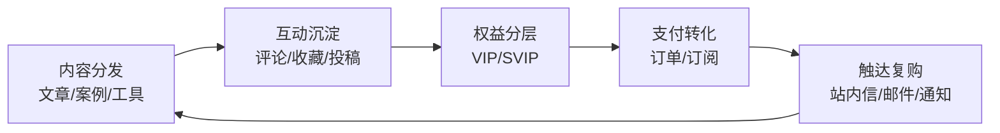

# OpenClaw 智信（Laravel + Vue）

> 内容变现 + 私域运营 + 会员增长的一体化项目骨架。  
> 本目录即 Laravel 项目根目录（`artisan`、`docker/`、`docker-compose*.yml` 同级）。

## 为什么值得用（卖点 / 优势）

- **不是 Demo，而是可运营闭环**：内容承载 → 互动沉淀 → 会员分层 → 支付转化 → 触达复购
- **模块齐全且可裁剪**：你可以从“内容站”起步，也可以直接做“会员制内容产品”
- **后台可用且可扩展**：Vue + Element Plus 的运营后台，覆盖内容/审核/订单/用户/配置/日志
- **可观测性内置**：对接 OpenClaw 任务日志，上报 + 检索 + 统计，排障与运营复盘更高效

## 核心业务模块（你能卖什么）

| 模块 | 说明 | 典型用途 |
| --- | --- | --- |
| 内容中心 | 文章、案例、副业案例、AI 工具、项目、付费资源 | SEO 流量入口、内容资产沉淀 |
| UGC 互动 | 投稿、评论、点赞、收藏、浏览历史 | 留存、社区活跃、内容供给效率 |
| 会员体系 | VIP / SVIP 分层、权益配置、到期提醒 | 阶梯收费、提升 ARPU |
| 支付与订单 | 订阅/订单、退款申请、发票申请 | 从浏览到付费的闭环 |
| 审核与风控 | 投稿审核、评论举报、审核日志 | 内容质量与合规 |
| 运营触达 | 站内信、邮件、系统通知 | 激活 / 召回 / 复购 |
| 站点配置 | 站点信息、皮肤、广告位等 | 快速品牌化与商业化 |
| OpenClaw 对接 | 任务日志上报 + 管理端检索统计 | 任务可观测、问题定位 |

## OpenClaw 对接（已落地能力）

本项目已集成 OpenClaw 任务日志相关能力，用于把“系统在执行什么 / 是否异常 / 运行趋势”可视化：

- **日志采集**：任务/运行记录落库（便于追溯）
- **管理端检索**：按类型/状态/时间过滤、查看详情
- **统计展示**：基础统计与趋势（用于排障与复盘）

> 相关实现可在代码中搜索 `OpenclawTaskLog` / `openclaw_task_logs` / `OpenclawTaskLogsIndex`。

## 技术栈

- 后端：PHP 8.2 + Laravel 10
- 前端：Vue 3 + Vite + Element Plus + Blade + Tailwind
- 数据：MySQL 8 + Redis 7
- 部署：Docker + Docker Compose

## 项目文档

为了避免命令混用，文档已拆分为两个版本：

- **本地开发文档**：`docs/01-开发环境配置.md`
- **服务器部署文档**：`docs/02-服务器部署配置.md`
- 数据库设计：`docs/02-数据库表字段详细设计.md`

## 截图占位（建议补几张就很“像产品”）

- `docs/screenshots/home.png`：前台首页
- `docs/screenshots/admin-dashboard.png`：后台总览
- `docs/screenshots/admin-content.png`：内容管理
- `docs/screenshots/openclaw-task-logs.png`：OpenClaw 任务日志

## 快速导航

- 本地开发：按 `docs/01-开发环境配置.md` 执行（开发环境可用 `npm run dev`）
- 服务器部署：按 `docs/02-服务器部署配置.md` 执行（生产环境只用 `npm run build`）

## 目录结构（简化）

```text
app/                # 业务代码（控制器/模型/服务）
database/           # 迁移、Seeder、测试数据
resources/          # Blade、Vue、样式资源
public/             # Web 入口与静态资源
docker/             # PHP/Nginx 容器配置
docs/               # 本地/服务器文档与设计文档
docker-compose.yml
docker-compose.server.yml
artisan
```

## 说明

- 生产环境请务必设置：
  - `APP_ENV=production`
  - `APP_DEBUG=false`
- `.env` 不提交到 Git；本地和服务器请分别维护。

## 业务闭环（可直接拿去讲）


